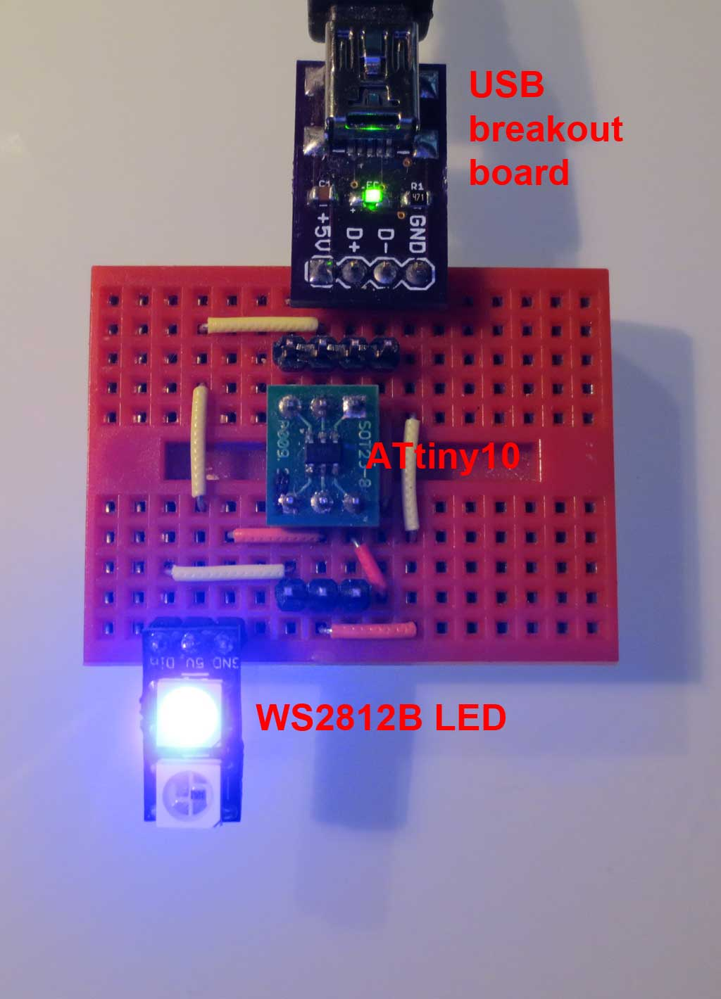

micro-wire
==========

This is an attempt at the smallest possible USB compliant device with V-USB. It uses an ATtiny10 
to control a single WS2812 LED via USB. 

The source started out as an amalganation of micronucleus and littlewire. All excess functionality was cut away.

Update 2014-01-07: 
 - It actually works on a ATtiny 10 now, yay! It still suffers from AVR-GCCs inability to generate proper 16 bit STS/LDS. Ticket to Atmel was submitted, let's see if they fix it.

Update 2014-03-19: 
 - I published a more detailed write-up of the project [here](http://cpldcpu.wordpress.com/2014/03/19/%c2%b5-wire-usb-on-an-attiny-10/).
 - Custom PCB design is finished and ordered.

### Features ###
 * Enumeration.
 * Only SETUP-request can be received.
 * Responses are limited to strings from flash memory or zero sized replies.
 * All SETUP packets that are not system request are forwarded to a WS2812 RGB LED on PB0.
 
### Memory usage ###
  * 1020 bytes Flash - Now down to 988 bytes with STS/LDS workaround.
    + Leaves 36 bytes of flash for addtional functionality!
  * SRAM:
    + 28 bytes static variables
    + 2 bytes return stack 
    + 2 bytes free
  * Uses only regs R16-R31
 
## Test set up ##

